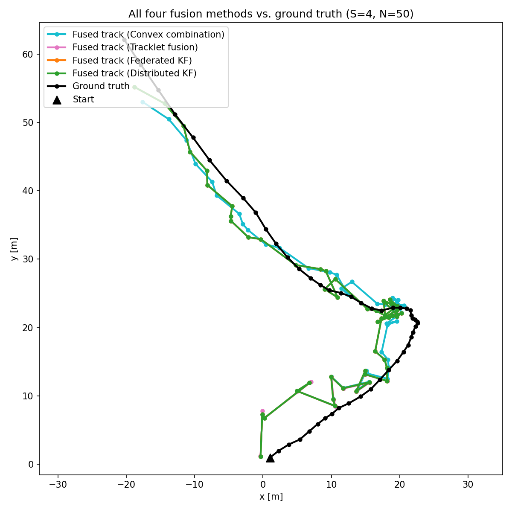

# Sensor_Fusion_Sim

Simulation of a constant-velocity target tracked by S sensors, fused at a
Fusion Center via four methods: Track-to-Track (naive convex combination),
Tracklet Fusion, Federated Kalman Filter, and Distributed Kalman Filter.

## Requirements

- Python 3
- `numpy`
- `matplotlib`

```
pip install numpy matplotlib
```

## How to run

Each fusion method can be run standalone (simulates + plots itself vs. naive
convex combination):

```
python convex_comb.py
python tracklet_fusion.py
python federated_filter.py
python distributed_filter.py
```

Run all four together on one shared measurement stream:

```
python run.py
```

Run a 100-run Monte Carlo comparison (mean +/- std RMSE per method):

```
python monte_carlo.py
```

## Results

### Single run (S=4 sensors, N=50 steps)

`python run.py`:

| Method              | Position RMSE |
|---------------------|--------------:|
| Convex combination  | 4.383 |
| Tracklet fusion     | 4.057 |
| Federated KF        | 4.040 |
| Distributed KF      | 4.040 |



### Monte Carlo (S=4 sensors, N=50 steps, 100 runs)

`python monte_carlo.py`:

| Method              | RMSE mean |
|---------------------|----------:|
| Convex combination  | 4.340 |
| Tracklet fusion     | 4.133 |
| Federated KF        | 4.091 |
| Distributed KF      | 4.091 |

Naive convex combination is consistently worst, since it ignores
cross-covariance between sensors. Tracklet, Federated, and Distributed all
improve on it; Federated and Distributed come out essentially tied here
since both correct for the shared-process-noise problem that naive fusion
ignores.
